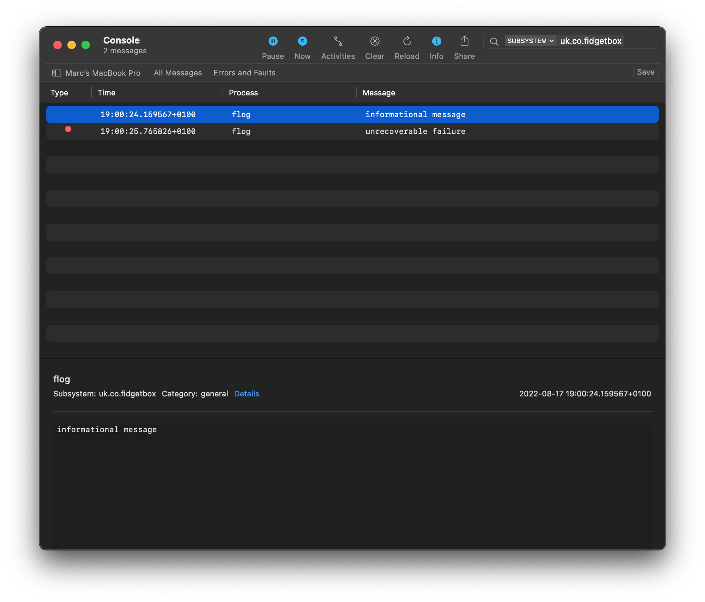
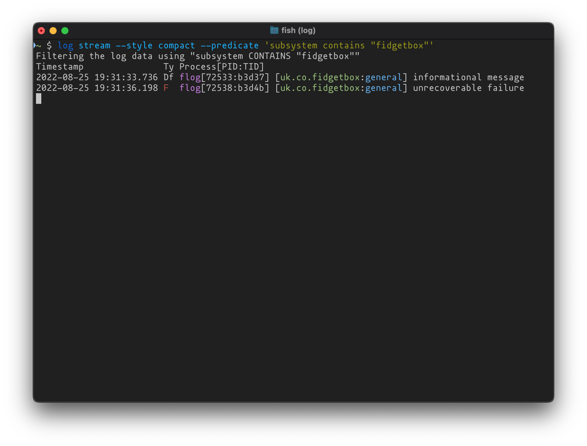

# flog

[](https://github.com/marcransome/flog/actions/workflows/codeql-analysis.yml) [](https://github.com/marcransome/flog/issues) [](https://opensource.org/licenses/mit-license.php) [](https://www.apple.com/macos/)

`flog` is a command-line tool for sending log messages to Apple's unified logging system and is primaily intended for use in scripts.

<hr>

## Rationale

> _Why not use `logger(1)`?_

`logger` doesn't support the full set of log levels provided by Apple's unified logging system, nor does it support specifying _subsystem_ and _category_ strings. `flog` on the other hand uses Apple's unified logging system C language APIs and supports both.

## Getting started

### Installation

Install with [Homebrew](https://brew.sh):

```bash
brew install marcransome/tap/flog
```

### Logging messages

To log a message using the `default` log level:

```bash
flog '<message>'
```

Optionally specify a _subsystem_ and _category_ using the `-s, --subsystem` and `-c, --category` options:

```bash
flog -s uk.co.fidgetbox -c general 'informational message'
```

Override the default log level using the `-l, --level` option and one of the values `info`, `debug`, `error` or `fault`:

```bash
flog -l fault -s uk.co.fidgetbox -c general 'unrecoverable failure'
```

`flog` can also read the log message from the standard input stream using a pipe:

```bash
./some-script | flog -l info
```

Or the log message can be read from a file using shell redirection:

```bash
flog < /var/log/some-script.log
```

> **Warning**:
> Log message strings are _public_ by default and can be read using the `log(1)` command or [Console](https://support.apple.com/en-gb/guide/console/welcome/mac) app. To mark a message as private add the `-p|--private` option to the command. Doing so will redact the message string, which will be shown as `'<private>'` when accessed using the methods previously mentioned. [Device Management Profiles](https://developer.apple.com/documentation/devicemanagement) can be used to grant access to private log messages.

### Reading log messages

Refer to the `log(1)` man page provided on macOS-based systems for extensive documentation on how to access system wide log messages, or alternatively use the [Console](https://support.apple.com/en-gb/guide/console/welcome/mac) app.

Here's an example log stream in Console, filtered by subsystem name, showing messages generated by `flog`:



And here's a similar log stream viewed with Apple's `log(1)` command:



## Building

### Requirements

* macOS (`11.x` or later)
* A C17 compiler
* CMake (`3.22` or later)

### Building from source

To perform an out-of-source build from the project directory:

```bash
cmake -S . -B build
cmake --build build
```

## Acknowledgements

* Trunk icon made by [Freepik](https://www.flaticon.com/authors/freepik) from [www.flaticon.com](https://www.flaticon.com/)

## License

`flog` is provided under the terms of the [MIT License](https://opensource.org/licenses/mit-license.php).

## Contact

Email me at [marc.ransome@fidgetbox.co.uk](mailto:marc.ransome@fidgetbox.co.uk) or [create an issue](https://github.com/marcransome/flog/issues).
